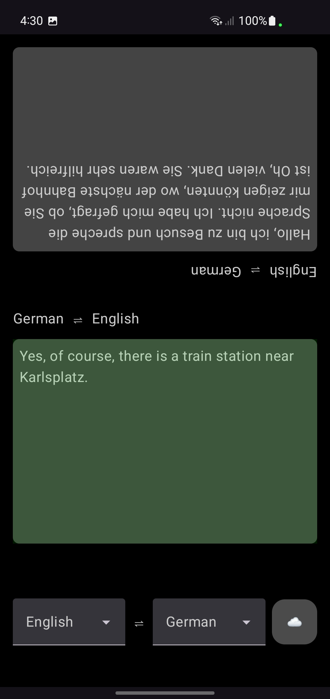

# trandroidlator //TODO: Change this name wtf
A native Android client for a sockets/gRPC/GCP bidirectional translation system. Built using [socket.io](https://socket.io/blog/native-socket-io-and-android/), Jetpack Compose, [AudioRecord](https://developer.android.com/reference/android/media/AudioRecord), Kotlin Flows, and Hilt. This is a native Android version of [this project](https://socket.io/blog/native-socket-io-and-android/), as an exercise more than anything else.

## Features
- Real-time bidirectional speech translation and interpretation to facilitate a conversation between two people that don't speak the same language
- Supports 100+ languages

### Prerequisites
- My [fork](https://github.com/critt/transcription_service) of [this repo](saharmor/realtime-transcription-playground), which serves as the server for this client. This client does not interact with GCP directly.
- GCP account with [Cloud Speech-to-Text API](https://cloud.google.com/speech-to-text/?hl=en), [Cloud Translation API](https://cloud.google.com/translate?hl=en), a service account, and a JSON credentials file for the service account.
    - These are actually prerequisites for the server (the fork mentioned above), not the client (this repo). I'm listing them here so you know what you are in for from the start, as these GCP services aren't necessarily free. The backend repo has more information on its own installation and setup. Just make sure to enable the translation API in GCP in addition to the Speech-to-Text API.
